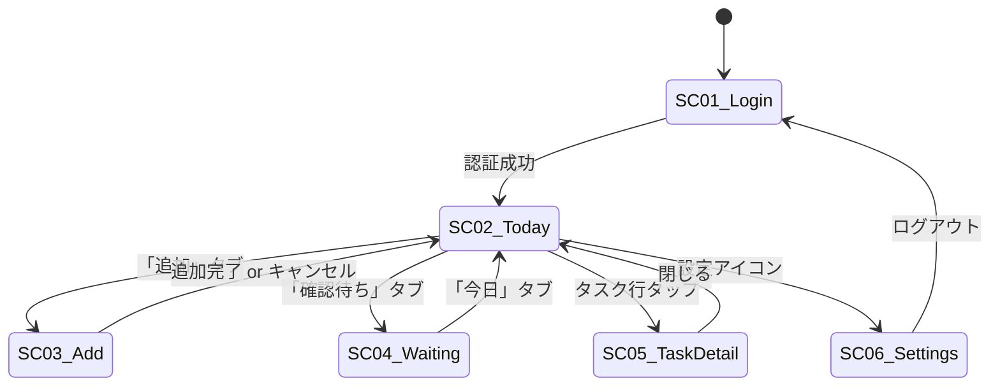
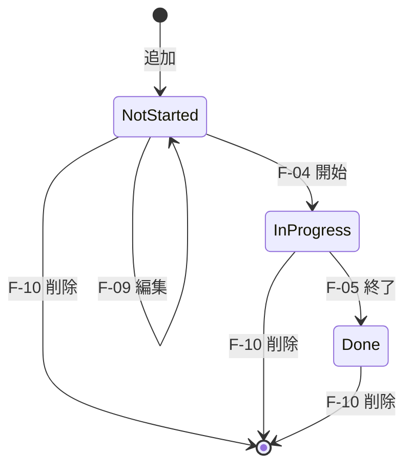
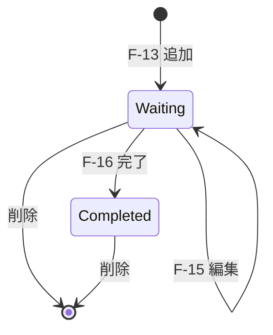

# 機能仕様書

| 項目           | 内容          |
| -------------- | ------------- |
| プロジェクト   | Taskchute PWA |
| 文書バージョン | 0.1           |
| 作成日         | 2026-05-19    |
| ステータス     | レビュー中    |

---

## 1. 画面一覧

| 画面ID | 画面名                     | 用途                                               |
| ------ | -------------------------- | -------------------------------------------------- |
| SC-01  | ログイン画面               | Google アカウント認証                              |
| SC-02  | 今日のタスク画面           | タスクシュートのメイン画面（進行中・次・本日一覧） |
| SC-03  | タスク追加画面             | 通常タスク・確認待ちタスクの新規追加               |
| SC-04  | 確認待ちリスト画面         | 確認待ちタスクの一覧・編集                         |
| SC-05  | タスク詳細画面（モーダル） | 個別タスクの編集・削除                             |
| SC-06  | 設定画面                   | カテゴリマスタ・同期設定・ログアウト               |

モバイル表示時はボトムタブで SC-02 / SC-03 / SC-04 / SC-06 を切り替える。PC 表示時はサイドナビ。

---

## 2. 画面遷移図

---

## 3. 機能詳細

### 3.1 F-01 ログイン

| 項目         | 内容                                                                                                                     |
| ------------ | ------------------------------------------------------------------------------------------------------------------------ |
| 画面         | SC-01                                                                                                                    |
| トリガー     | アプリ起動時、未認証または期限切れ                                                                                       |
| 入力         | Google アカウント（OAuth ポップアップ）                                                                                  |
| 処理         | Google Identity Services で `requestAccessToken({prompt:''})` を試行（silent renewal）。失敗時のみ明示的なログインを促す |
| 取得スコープ | `spreadsheets`, `calendar`, `tasks`                                                                                      |
| 出力         | アクセストークンを sessionStorage に保管、SC-02 へ遷移                                                                   |
| エラー       | 認可拒否 → 再試行ボタン表示。スコープ不足 → 不足スコープを明示し再認可                                                   |

### 3.2 F-02 タスク一覧表示（SC-02）

| 項目               | 内容                                                                         |
| ------------------ | ---------------------------------------------------------------------------- |
| データソース       | TaskDB シート（当日分）                                                      |
| ソート順           | ScheduledStartTime 昇順                                                      |
| 表示要素           | 進行中タスクカード、次のタスクカード、本日タスク一覧テーブル                 |
| 進行中タスクの判定 | `Status === 'In Progress'` の最初の行                                        |
| 次のタスクの判定   | `Status === 'Not Started'` の最初の行（ScheduledStartTime 昇順）             |
| 各行表示           | ステータスドット、タスク名、予定時刻、見積、カテゴリバッジ、ステータスバッジ |
| 更新タイミング     | 初回読み込み + 30 秒ごとの自動再取得 + 操作後の強制更新                      |

### 3.3 F-04 タスク開始

| 項目           | 内容                                                                                              |
| -------------- | ------------------------------------------------------------------------------------------------- |
| 前提           | `Status='Not Started'` のタスクが存在                                                             |
| トリガー       | 「▶ 次を開始」ボタン押下                                                                          |
| 楽観的更新     | 即座にステータスを `In Progress` 表示、タイマー開始                                               |
| サーバー側処理 | TaskDB の `Status='In Progress'`, `ActualStartTime=now` を更新、Calendar イベントを YELLOW に変更 |
| 失敗時         | 楽観的更新をロールバック、トースト通知                                                            |

### 3.4 F-05 タスク終了

| 項目           | 内容                                                                                                        |
| -------------- | ----------------------------------------------------------------------------------------------------------- |
| 前提           | `Status='In Progress'` のタスクが存在                                                                       |
| トリガー       | 「■ 現在を終了」ボタン押下                                                                                  |
| 楽観的更新     | 即座にステータスを `Done` 表示、タイマー停止                                                                |
| サーバー側処理 | TaskDB の `Status='Done'`, `ActualEndTime=now` を更新、Calendar イベントを GREEN に変更し実績時刻にリサイズ |
| 失敗時         | 楽観的更新をロールバック、トースト通知                                                                      |

### 3.5 F-06〜F-08 タイマー・進捗バー・超過警告

| 項目     | 内容                                                           |
| -------- | -------------------------------------------------------------- |
| 表示     | 進行中タスクカード内                                           |
| 形式     | `HH:MM:SS`（1 時間未満は `MM:SS`）                             |
| 更新間隔 | 1 秒ごと（requestAnimationFrame ベース）                       |
| 進捗バー | `経過秒 / (見積分 × 60)` を 0〜100% で表示                     |
| 色       | 通常: オレンジ、超過: 赤                                       |
| 超過警告 | バー赤化 + `+X分超過` テキスト + 任意で通知 API による OS 通知 |

### 3.6 F-03 タスク追加

| 項目           | 内容                                                                                    |
| -------------- | --------------------------------------------------------------------------------------- |
| 画面           | SC-03                                                                                   |
| 入力項目       | タスク名（必須）、見積分（必須・正の整数）、カテゴリ（任意、選択）、開始時刻（任意）    |
| バリデーション | タスク名: 1〜200 文字 / 見積: 1〜480 分 / 開始時刻: 任意の解析可能な日時                |
| 開始時刻省略時 | TaskDB の最終タスクの ScheduledEndTime を使用、なければ現在時刻                         |
| サーバー側処理 | 1) Calendar イベント作成（GRAY） 2) TaskDB 行追加 3) TaskID と CalendarEventID を紐付け |
| 完了表示       | トースト「タスクを追加しました」 + 入力欄クリア                                         |

### 3.7 F-13 確認待ちタスク追加

| 項目               | 内容                                                                                  |
| ------------------ | ------------------------------------------------------------------------------------- |
| 画面               | SC-03 下部                                                                            |
| 入力項目           | 依頼内容（必須）、依頼先（任意）、フォローアップ日（任意）                            |
| バリデーション     | 依頼内容: 1〜200 文字 / 日付: 過去日不可                                              |
| Google Tasks 連携  | `[WAIT] 依頼先: 依頼内容` 形式のタスクを `@default` リストに作成                      |
| WaitingList 行追加 | SystemTaskID（UUID）, TaskName, WaitingFor, DelegatedDate, FollowUpDate, GoogleTaskID |
| 日付処理           | JST の日付を `new Date(yyyy, mm-1, dd)` で生成（UTC ワークアラウンド不要）            |

### 3.8 F-16 確認待ちタスク完了

| 項目     | 内容                                                        |
| -------- | ----------------------------------------------------------- |
| トリガー | リスト行のチェックボックス押下                              |
| 処理     | Google Tasks API で当該タスクを `status='completed'` に更新 |
| 表示     | 取り消し線 + 半透明化                                       |

### 3.9 F-17 ルーチンタスク翌週分生成

| 項目        | 内容                                                                                                         |
| ----------- | ------------------------------------------------------------------------------------------------------------ |
| トリガー    | SC-02 下部「📅 翌週のルーチンタスクを生成」ボタン                                                            |
| 処理        | 1) RoutineTasks シートを取得 2) 翌週月〜金の日付ごとに該当タスクを評価 3) 既存 TaskDB と重複しないものを追加 |
| Schedule 値 | `毎日` / `月` / `火` ... / `初日` / `末日` / `15日`（数字+日）                                               |
| 結果通知    | トースト「N件のルーチンタスクを生成しました」                                                                |

### 3.10 F-18 Google Calendar への反映

すべてのタスク CRUD は対応する Calendar イベントを同時に更新する。

| タスク操作 | Calendar 操作                              | イベント色 |
| ---------- | ------------------------------------------ | ---------- |
| 追加       | createEvent                                | GRAY       |
| 開始       | setColor                                   | YELLOW     |
| 終了       | setColor + setTime(actualStart, actualEnd) | GREEN      |
| 編集       | setTitle / setTime                         | 既存色維持 |
| 削除       | deleteEvent                                | -          |

### 3.11 F-19 Calendar → Sheet 逆同期

| 項目     | 内容                                                                                                                                                                  |
| -------- | --------------------------------------------------------------------------------------------------------------------------------------------------------------------- |
| トリガー | アプリ起動時、手動同期ボタン、30 秒ごとのバックグラウンド                                                                                                             |
| 対象期間 | 今日 ±15 日                                                                                                                                                           |
| 処理     | 1) Calendar イベント取得 2) CalendarEventID で TaskDB と突合 3) Calendar側で変更されている項目を Sheet に反映 4) Calendar 側で削除されたイベントの行を Sheet から削除 |
| 競合解決 | 最終更新時刻が新しい方を採用（last-write-wins）。Status=Done は同期対象外                                                                                             |

### 3.12 F-20 Google Tasks 同期

| 項目           | 内容                                                                                                                                                                        |
| -------------- | --------------------------------------------------------------------------------------------------------------------------------------------------------------------------- |
| トリガー       | アプリ起動時、手動同期ボタン                                                                                                                                                |
| 処理           | 1) Tasks.list('@default') で全件取得 2) GoogleTaskID で WaitingList と突合 3) 完了状態・タイトル・期日を双方向同期 4) Tasks 側で削除されたタスクの行を WaitingList から削除 |
| 削除時の安全策 | ループ中の行削除は避け、削除対象行番号を集めて降順ソート後にまとめて削除                                                                                                    |

### 3.13 F-12 カテゴリマスタ編集

| 項目   | 内容                           |
| ------ | ------------------------------ |
| 画面   | SC-06                          |
| 表示   | カテゴリ一覧（テキストリスト） |
| 操作   | 追加・編集・削除・並び替え     |
| 永続化 | Settings シート A 列に反映     |

---

## 4. バリデーション規則一覧

| 項目             | ルール                                   | エラーメッセージ                           |
| ---------------- | ---------------------------------------- | ------------------------------------------ |
| タスク名         | 必須、1〜200 文字、改行不可              | 「タスク名を入力してください」             |
| 見積分           | 必須、正の整数、1〜480                   | 「見積は1〜480分の範囲で入力してください」 |
| カテゴリ         | 任意、Settings シートに存在する値        | 「不正なカテゴリです」                     |
| 開始時刻         | 任意、ISO 8601 または `yyyy/MM/dd HH:mm` | 「日時の形式が正しくありません」           |
| 依頼内容         | 必須、1〜200 文字                        | 「依頼内容を入力してください」             |
| フォローアップ日 | 任意、本日以降                           | 「過去の日付は指定できません」             |

---

## 5. エラー処理方針

| 種別                 | 表示                                        | 復旧アクション                     |
| -------------------- | ------------------------------------------- | ---------------------------------- |
| ネットワークエラー   | トースト + 操作キュー保存                   | 自動再試行（3 回、指数バックオフ） |
| 認証エラー（401）    | モーダル「再ログインが必要です」            | ログイン画面へ遷移                 |
| スコープ不足（403）  | モーダル「権限が必要です」                  | 再認可フロー起動                   |
| クォータ超過（429）  | トースト「しばらく待ってから再試行」        | 60 秒後自動再試行                  |
| バリデーションエラー | 入力欄下に赤字表示                          | ユーザーが入力修正                 |
| 想定外エラー         | トースト「予期せぬエラー」 + コンソールログ | リロード推奨                       |

---

## 6. 状態遷移

### 6.1 タスクのライフサイクル

### 6.2 確認待ちタスクのライフサイクル

---

## 7. 改訂履歴

| 日付       | バージョン | 内容 | 担当 |
| ---------- | ---------- | ---- | ---- |
| 2026-05-19 | 0.1        | 初版 | 竹内 |
