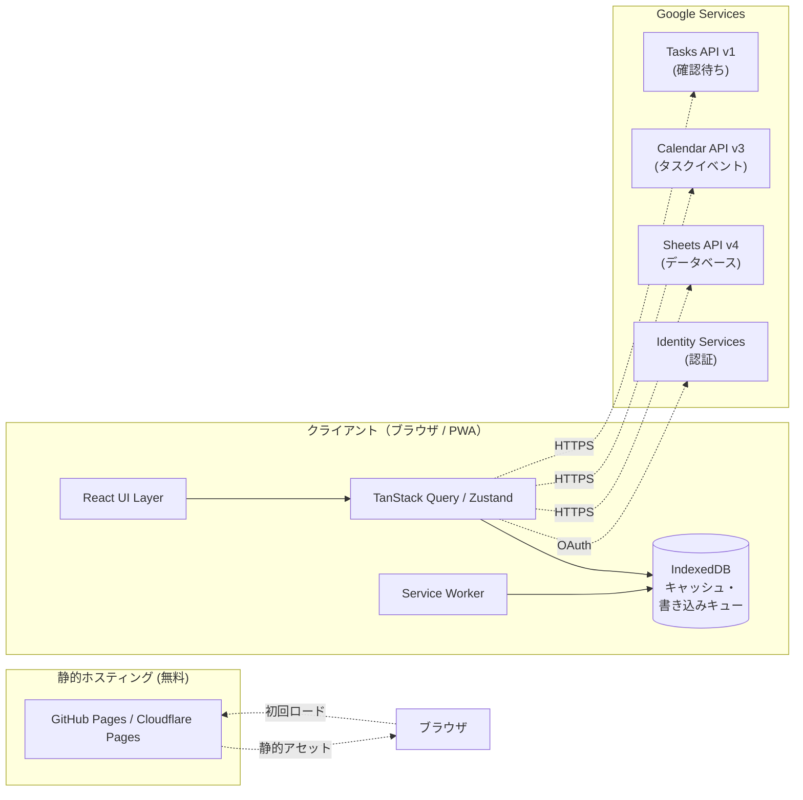
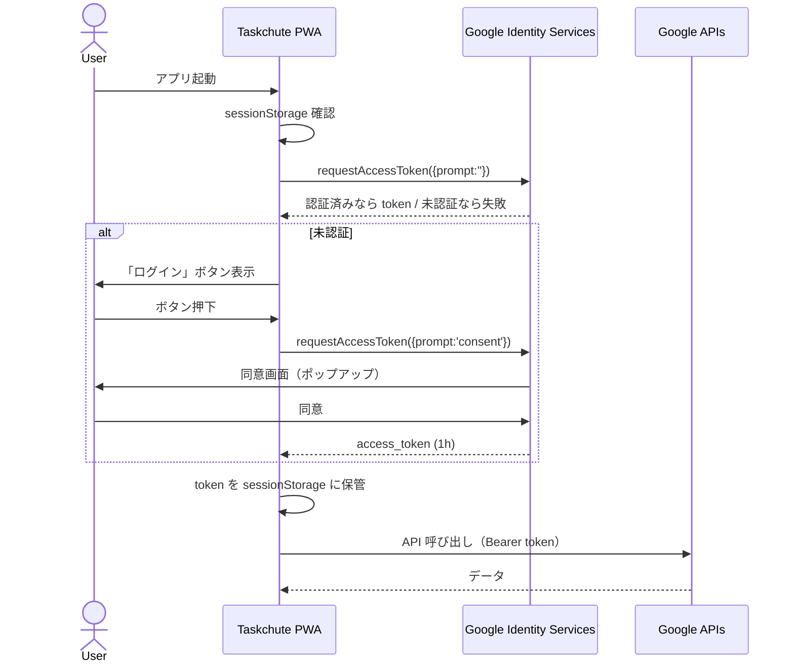
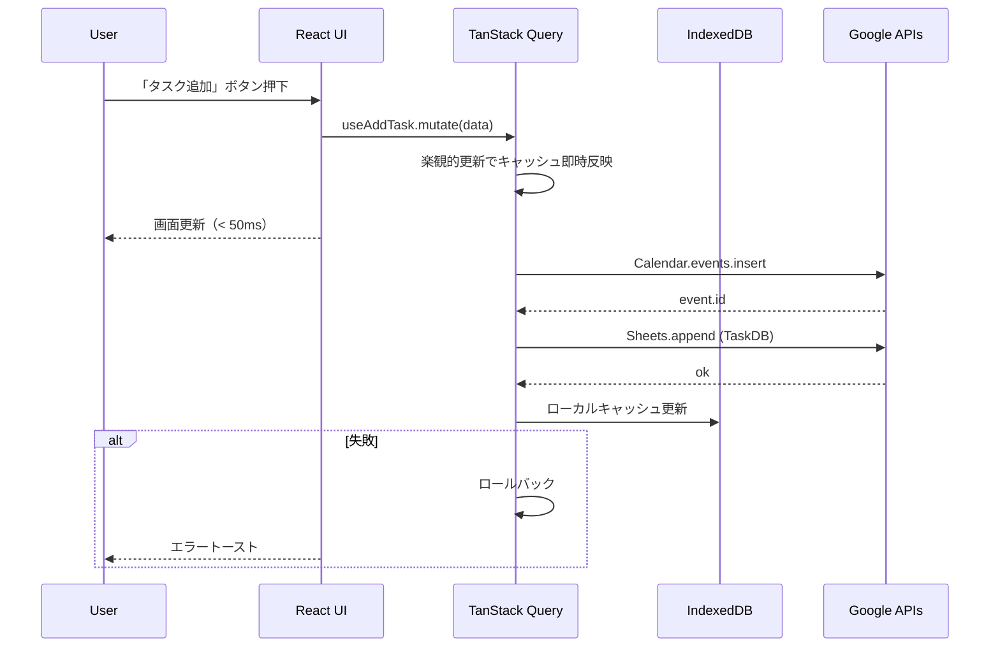
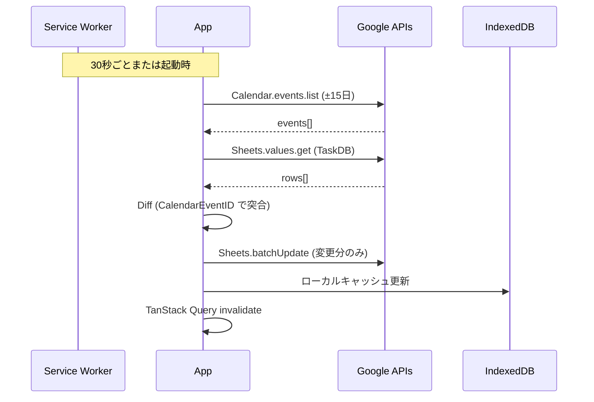
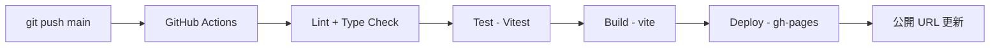

# アーキテクチャ設計書

| 項目 | 内容 |
|------|------|
| プロジェクト | Taskchute PWA |
| 文書バージョン | 0.1 |
| 作成日 | 2026-05-19 |
| ステータス | レビュー中 |

---

## 1. システム構成

### 1.1 全体図



### 1.2 サーバー構成

**バックエンドサーバーは存在しない。** 静的ファイルホスティングのみ。すべてのビジネスロジックはブラウザ上で実行され、データの永続化は Google サービス（Sheets / Calendar / Tasks）に委譲する。

---

## 2. 技術スタック

### 2.1 ランタイム・ビルド

| カテゴリ | 採用技術 | 理由 |
|---------|---------|------|
| 言語 | TypeScript 5.x | 型安全性、現行 GAS の課題 P-03 解消 |
| フレームワーク | React 18.x | 採用実績豊富、shadcn/ui との親和性 |
| ビルドツール | Vite 5.x | 高速 HMR、PWA プラグイン充実 |
| Node ランタイム | Node.js 20 LTS | LTS で安定性確保 |

### 2.2 UI / スタイル

| カテゴリ | 採用技術 | 理由 |
|---------|---------|------|
| CSS | Tailwind CSS 3.x | ユーティリティファースト、保守容易 |
| コンポーネント | shadcn/ui | コピー型のため依存軽量、カスタマイズ容易 |
| アイコン | lucide-react | shadcn/ui 標準 |
| 日時 | date-fns 3.x + date-fns-tz | TZ 安全な日付処理、課題 P-04 解消 |

### 2.3 状態管理・データ層

| カテゴリ | 採用技術 | 理由 |
|---------|---------|------|
| サーバー状態 | TanStack Query 5.x | キャッシュ・楽観的更新・自動再取得 |
| クライアント状態 | Zustand 4.x | 軽量、ボイラープレート最小 |
| ローカル永続化 | IndexedDB（Dexie 4.x） | オフライン対応 |

### 2.4 認証・外部 API

| カテゴリ | 採用技術 |
|---------|---------|
| OAuth | Google Identity Services (GIS) |
| Google API | `gapi.client`（必要最小限のサービスのみ） |

### 2.5 PWA / オフライン

| カテゴリ | 採用技術 |
|---------|---------|
| Service Worker | vite-plugin-pwa（Workbox 7） |
| キャッシュ戦略 | Network-first + Stale-while-revalidate |

### 2.6 品質保証

| カテゴリ | 採用技術 |
|---------|---------|
| 単体テスト | Vitest 1.x |
| コンポーネントテスト | @testing-library/react |
| E2E テスト | Playwright 1.x |
| Lint | ESLint 9.x（typescript-eslint） |
| Format | Prettier 3.x |
| 型チェック | `tsc --noEmit` |

### 2.7 デプロイ

| カテゴリ | 採用技術 |
|---------|---------|
| ホスティング | GitHub Pages（メイン） / Cloudflare Pages（候補） |
| CI | GitHub Actions |

---

## 3. レイヤー構成

```
┌─────────────────────────────────────────┐
│  Presentation Layer                      │
│   - Routes (pages)                       │
│   - Components (UI)                      │
├─────────────────────────────────────────┤
│  Feature Layer                           │
│   - features/tasks                       │
│   - features/waiting                     │
│   - features/routines                    │
│   - features/auth                        │
│   - features/sync                        │
├─────────────────────────────────────────┤
│  Domain Layer                            │
│   - models (Task, WaitingTask, ...)     │
│   - validators                           │
│   - time utilities                       │
├─────────────────────────────────────────┤
│  Infrastructure Layer                    │
│   - lib/google/sheets                    │
│   - lib/google/calendar                  │
│   - lib/google/tasks                     │
│   - lib/db (IndexedDB)                   │
│   - lib/auth                             │
└─────────────────────────────────────────┘
```

各レイヤーは下位レイヤーのみ参照可能。上位への依存禁止。

---

## 4. 認証アーキテクチャ

### 4.1 採用方式

**Google Identity Services（GIS）のトークンモデル** を採用。Implicit Grant 相当だが、ポップアップ／iframe 経由の silent renewal をサポートする現代的な方式。

### 4.2 認証フロー（初回）



### 4.3 トークン更新

- アクセストークン期限切れ（401）を検知したら自動的に `requestAccessToken({prompt:''})` で silent renewal を試行
- silent renewal に失敗した場合のみ明示的なログイン画面へ遷移

### 4.4 スコープ設計（最小権限）

| スコープ | 用途 |
|---------|------|
| `https://www.googleapis.com/auth/spreadsheets` | TaskDB / WaitingList / Settings / RoutineTasks の読み書き |
| `https://www.googleapis.com/auth/calendar.events` | Taskchute カレンダーのイベント操作（カレンダー一覧は不要） |
| `https://www.googleapis.com/auth/tasks` | 確認待ちタスクの読み書き |

`drive.metadata.readonly` 等の余剰スコープは要求しない。

---

## 5. データフロー

### 5.1 タスク追加フロー



### 5.2 カレンダー逆同期フロー（定期）



---

## 6. オフライン戦略

### 6.1 読み取り

- IndexedDB に最新のタスク一覧をミラー保存
- オフライン時は IndexedDB から表示
- 接続復帰時に最新化

### 6.2 書き込み

- オフライン時の書き込み操作は IndexedDB の `mutation_queue` に積む
- Service Worker の Background Sync API で再接続時に自動フラッシュ
- フラッシュ中は順序保証（FIFO）

### 6.3 競合解決

| シナリオ | 解決方針 |
|---------|---------|
| 同一タスクの編集競合 | 最終更新時刻が新しい方を採用 |
| ローカルで開始 → クラウドで先に終了済み | クラウドを優先、ローカル変更を破棄しユーザーに通知 |
| ローカル追加 → 同期前に Calendar 側で同名イベント追加 | 別タスクとして扱う（CalendarEventID が異なるため） |

---

## 7. デプロイ構成

### 7.1 環境

| 環境 | URL | 用途 |
|------|-----|------|
| 開発 | `http://localhost:5173` | ローカル開発 |
| 本番 | `https://<user>.github.io/taskchute-pwa/` | エンドユーザー利用 |

### 7.2 CI/CD パイプライン



### 7.3 環境変数

| 変数 | 用途 | 公開可否 |
|------|------|---------|
| `VITE_GOOGLE_OAUTH_CLIENT_ID` | OAuth クライアントID | 公開可（SPAは秘匿不可前提） |
| `VITE_CALENDAR_ID` | Taskchute カレンダーID | 公開可（IDだけでは操作不可） |
| `VITE_TASKCHUTE_SPREADSHEET_ID` | TaskDB スプレッドシートID | 公開可（権限がなければ操作不可） |

---

## 8. セキュリティ

| 項目 | 対策 |
|------|------|
| トークン保管 | sessionStorage（タブ閉じで破棄）。localStorage は使わない |
| XSS 対策 | React の自動エスケープに依存、`dangerouslySetInnerHTML` 全面禁止 |
| CSRF | SPA + Bearer Token のため対象外 |
| Content Security Policy | meta タグでスクリプトソースを Google ドメインに限定 |
| 依存パッケージ脆弱性 | `npm audit` を CI で実行、Dependabot 有効化 |

---

## 9. ディレクトリ構造

```
taskchute-pwa/
├── README.md
├── docs/
├── public/
│   ├── icons/
│   └── manifest.webmanifest
├── src/
│   ├── main.tsx
│   ├── App.tsx
│   ├── routes/
│   │   ├── TodayRoute.tsx
│   │   ├── AddRoute.tsx
│   │   ├── WaitingRoute.tsx
│   │   └── SettingsRoute.tsx
│   ├── features/
│   │   ├── auth/
│   │   │   ├── AuthProvider.tsx
│   │   │   ├── useAuth.ts
│   │   │   └── LoginScreen.tsx
│   │   ├── tasks/
│   │   │   ├── api/
│   │   │   │   ├── addTask.ts
│   │   │   │   ├── startTask.ts
│   │   │   │   ├── endTask.ts
│   │   │   │   └── listTasks.ts
│   │   │   ├── hooks/
│   │   │   │   ├── useTasks.ts
│   │   │   │   └── useTaskMutations.ts
│   │   │   ├── components/
│   │   │   │   ├── CurrentTaskCard.tsx
│   │   │   │   ├── NextTaskCard.tsx
│   │   │   │   ├── TaskList.tsx
│   │   │   │   ├── TaskRow.tsx
│   │   │   │   └── TaskTimer.tsx
│   │   │   ├── validators.ts
│   │   │   └── types.ts
│   │   ├── waiting/
│   │   │   └── ...（同様）
│   │   ├── routines/
│   │   │   └── ...
│   │   └── sync/
│   │       ├── syncCalendar.ts
│   │       └── syncTasks.ts
│   ├── lib/
│   │   ├── google/
│   │   │   ├── client.ts
│   │   │   ├── sheets.ts
│   │   │   ├── calendar.ts
│   │   │   └── tasks.ts
│   │   ├── db/
│   │   │   ├── schema.ts
│   │   │   └── mutationQueue.ts
│   │   ├── time/
│   │   │   └── jst.ts
│   │   └── env.ts
│   ├── components/
│   │   └── ui/   ← shadcn/ui
│   ├── store/
│   │   └── uiStore.ts
│   └── styles/
│       └── globals.css
├── tests/
│   └── e2e/
│       ├── add-task.spec.ts
│       ├── start-end-task.spec.ts
│       └── waiting-list.spec.ts
├── .env.example
├── .eslintrc.cjs
├── .prettierrc
├── vite.config.ts
├── tsconfig.json
├── package.json
└── playwright.config.ts
```

---

## 10. 改訂履歴

| 日付 | バージョン | 内容 | 担当 |
|------|----------|------|------|
| 2026-05-19 | 0.1 | 初版 | 竹内 |
