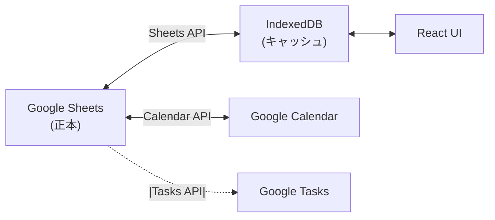

# データモデル設計書

| 項目 | 内容 |
|------|------|
| プロジェクト | Taskchute PWA |
| 文書バージョン | 0.1 |
| 作成日 | 2026-05-19 |
| ステータス | レビュー中 |

---

## 1. データソース構成

データの正本は **既存の Google Sheets** を継続利用する（要件 C-02 / C-03）。ブラウザ側 IndexedDB はあくまでキャッシュ・書き込みキュー・オフラインバッファとして機能する。



---

## 2. シート定義（既存スキーマを継承）

### 2.1 `TaskDB` シート

| カラム名 | 型 | 説明 | 必須 |
|---------|-----|------|------|
| `TaskID` | string (UUID) | タスクの一意ID | ✓ |
| `TaskName` | string | タスク名（1〜200文字） | ✓ |
| `Category` | string | カテゴリ（Settings 参照） | |
| `EstimateMinutes` | number | 見積分数（1〜480） | ✓ |
| `ScheduledStartTime` | datetime | 予定開始時刻 | ✓ |
| `ScheduledEndTime` | datetime | 予定終了時刻 | ✓ |
| `ActualStartTime` | datetime | 実績開始時刻 | |
| `ActualEndTime` | datetime | 実績終了時刻 | |
| `Status` | enum | `Not Started` / `In Progress` / `Done` | ✓ |
| `CalendarEventID` | string | 紐付く Calendar イベントID | ✓ |

### 2.2 `WaitingList` シート

| カラム名 | 型 | 説明 | 必須 |
|---------|-----|------|------|
| `SystemTaskID` | string (UUID) | 内部ID | ✓ |
| `TaskName` | string | 依頼内容 | ✓ |
| `WaitingFor` | string | 依頼先 | |
| `DelegatedDate` | datetime | 依頼日 | ✓ |
| `FollowUpDate` | datetime | フォローアップ日 | |
| `GoogleTaskID` | string | 紐付く Google Tasks のID | ✓ |

### 2.3 `Settings` シート

| カラム名 | 型 | 説明 |
|---------|-----|------|
| A列 | string | カテゴリマスタ（2行目以降） |

### 2.4 `RoutineTasks` シート

| カラム名 | 型 | 説明 |
|---------|-----|------|
| `Schedule` | string | `毎日` / `月`〜`日` / `初日` / `末日` / `15日`（数字+日） |
| `TaskName` | string | タスク名 |
| `StartTime` | time | 開始時刻（HH:mm） |
| `Category` | string | カテゴリ |
| `EstimateMinutes` | number | 見積分数 |

---

## 3. TypeScript 型定義

### 3.1 ドメインモデル

```typescript
// src/features/tasks/types.ts

export const TaskStatus = {
  NotStarted: 'Not Started',
  InProgress: 'In Progress',
  Done: 'Done',
} as const;
export type TaskStatus = typeof TaskStatus[keyof typeof TaskStatus];

export interface Task {
  taskId: string;
  taskName: string;
  category: string | null;
  estimateMinutes: number;
  scheduledStartTime: Date;
  scheduledEndTime: Date;
  actualStartTime: Date | null;
  actualEndTime: Date | null;
  status: TaskStatus;
  calendarEventId: string;
}

export interface TaskInput {
  taskName: string;
  estimateMinutes: number;
  category?: string;
  startTime?: Date;
}
```

```typescript
// src/features/waiting/types.ts

export interface WaitingTask {
  systemTaskId: string;
  taskName: string;
  waitingFor: string | null;
  delegatedDate: Date;
  followUpDate: Date | null;
  googleTaskId: string;
  completed: boolean;
}

export interface WaitingTaskInput {
  taskName: string;
  waitingFor?: string;
  followUpDate?: Date;
}
```

```typescript
// src/features/routines/types.ts

export type Schedule =
  | { kind: 'daily' }
  | { kind: 'weekday'; day: 0 | 1 | 2 | 3 | 4 | 5 | 6 }
  | { kind: 'monthFirst' }
  | { kind: 'monthLast' }
  | { kind: 'dayOfMonth'; day: number };

export interface RoutineTask {
  schedule: Schedule;
  taskName: string;
  startTime: { hour: number; minute: number };
  category: string;
  estimateMinutes: number;
}
```

### 3.2 シリアライザ

シートから読んだ生データ（`string[][]`）を上記の型に変換する関数群を `src/lib/google/serializers.ts` に集約する。

```typescript
export function rowToTask(headers: string[], row: unknown[]): Task;
export function taskToRow(headers: string[], task: Task): unknown[];
```

---

## 4. IndexedDB スキーマ（Dexie）

```typescript
// src/lib/db/schema.ts

import Dexie, { Table } from 'dexie';

class TaskchuteDB extends Dexie {
  tasks!: Table<Task, string>;
  waitingTasks!: Table<WaitingTask, string>;
  categories!: Table<{ name: string; order: number }, string>;
  mutationQueue!: Table<MutationRecord, number>;
  meta!: Table<{ key: string; value: unknown }, string>;

  constructor() {
    super('taskchute');
    this.version(1).stores({
      tasks: 'taskId, status, scheduledStartTime',
      waitingTasks: 'systemTaskId, completed, followUpDate',
      categories: 'name, order',
      mutationQueue: '++id, createdAt, status',
      meta: 'key',
    });
  }
}

export const db = new TaskchuteDB();

export interface MutationRecord {
  id?: number;
  createdAt: number;
  kind: 'addTask' | 'startTask' | 'endTask' | 'editTask' | 'deleteTask'
      | 'addWaiting' | 'editWaiting' | 'completeWaiting';
  payload: unknown;
  status: 'pending' | 'syncing' | 'failed';
  retries: number;
  lastError?: string;
}
```

---

## 5. 外部 API 契約

### 5.1 Google Sheets API v4

**主な呼び出し**

| 操作 | エンドポイント | 用途 |
|------|--------------|------|
| 読み取り | `spreadsheets.values.get` | シートデータ取得 |
| 追加 | `spreadsheets.values.append` | 新規行追加 |
| 更新 | `spreadsheets.values.update` | 既存行更新 |
| 一括更新 | `spreadsheets.values.batchUpdate` | 複数セル更新 |
| 削除 | `spreadsheets.batchUpdate` (DeleteDimensionRequest) | 行削除 |

**ヘッダー位置の動的解決**

現行 GAS と同様にヘッダー名（`TaskID`, `Status` 等）からインデックスを求める。ただし `indexOf(...) === -1` チェックを必ず行い、見つからない場合は型ガード関数で例外を投げる。

### 5.2 Google Calendar API v3

| 操作 | エンドポイント | 用途 |
|------|--------------|------|
| 一覧取得 | `events.list` | ±15日のイベント |
| 作成 | `events.insert` | タスク追加時 |
| 更新 | `events.patch` | 編集・色変更 |
| 削除 | `events.delete` | タスク削除 |

**イベントの命名規約**（現行踏襲）
- カテゴリあり: `(カテゴリ)_タスク名`
- カテゴリなし: `タスク名`

**色コード**

| 状態 | colorId |
|------|---------|
| Not Started | `8`（GRAY） |
| In Progress | `5`（YELLOW） |
| Done | `2`（GREEN） |

### 5.3 Google Tasks API v1

| 操作 | エンドポイント | 用途 |
|------|--------------|------|
| 一覧 | `tasks.list` | WaitingList 同期 |
| 作成 | `tasks.insert` | 確認待ちタスク追加 |
| 更新 | `tasks.update` / `patch` | 編集・完了 |
| 取得 | `tasks.get` | 単一タスク取得 |

**タイトル規約**（現行踏襲）
- 依頼先あり: `[WAIT] 依頼先: 依頼内容`
- 依頼先なし: `[WAIT] 依頼内容`

---

## 6. 同期戦略

### 6.1 同期トリガー

| トリガー | 同期対象 |
|---------|---------|
| アプリ起動時 | 全シート + Calendar + Tasks |
| バックグラウンド（30秒） | TaskDB + Calendar（軽量） |
| 手動同期ボタン | 全シート + Calendar + Tasks |
| 操作直後 | 該当エンティティのみ |

### 6.2 競合解決ポリシー

last-write-wins を基本とし、以下の例外を設ける。

| シナリオ | 解決 |
|---------|------|
| Status=Done のタスクが Calendar 側で更新 | 無視（変更しない） |
| ローカルキューに未送信操作がある状態でクラウド側変更 | キュー実行後に再同期 |
| Calendar 側に同名イベント追加 | 別タスクとして扱う |

---

## 7. データバリデーション

ドメイン層 (`src/features/*/validators.ts`) に Zod スキーマを定義し、入力値・API レスポンス双方を検証する。

```typescript
import { z } from 'zod';

export const TaskInputSchema = z.object({
  taskName: z.string().min(1).max(200),
  estimateMinutes: z.number().int().min(1).max(480),
  category: z.string().max(50).optional(),
  startTime: z.date().optional(),
});
```

---

## 8. 改訂履歴

| 日付 | バージョン | 内容 | 担当 |
|------|----------|------|------|
| 2026-05-19 | 0.1 | 初版 | 竹内 |
