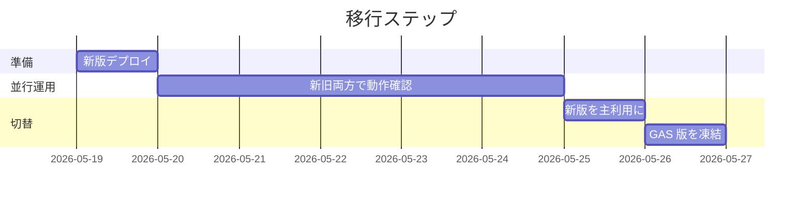

# 開発計画書

| 項目 | 内容 |
|------|------|
| プロジェクト | Taskchute PWA |
| 文書バージョン | 0.1 |
| 作成日 | 2026-05-19 |
| ステータス | レビュー中 |

---

## 1. 開発方針

- **バイブコーディング** を主軸に、Claude Code をペアプログラマとして利用
- 各フェーズの完了時に動作確認可能な成果物を残す（インクリメンタル開発）
- 既存 GAS 版は維持し、新版が完成・検証されるまで切り替えない（並行運用）
- 1 機能 = 1 ブランチ = 1 PR（個人開発でもセルフレビューする）

---

## 2. マイルストーン

| M | 名称 | 完了条件 | 想定工数 |
|---|------|---------|---------|
| M0 | 設計レビュー完了 | ドキュメント一式の承認 | **完了予定** |
| M1 | 環境構築完了 | `npm run dev` で空画面が起動 | 0.5 日 |
| M2 | 認証 MVP | Google ログインができ、Sheets API が叩ける | 1 日 |
| M3 | タスク CRUD | 追加・開始・終了・編集・削除がブラウザから可能 | 2 日 |
| M4 | 同期機能 | Calendar / Tasks 双方向同期、ルーチン生成 | 2 日 |
| M5 | PWA 化 | オフライン動作、ホーム画面追加 | 1 日 |
| M6 | テスト完了 | 自動テスト全通過、Lighthouse 目標達成 | 1.5 日 |
| M7 | 本番リリース | デプロイ完了、GAS 版から切替 | 0.5 日 |

合計想定工数: **約 8.5 日**（純粋作業時間。実カレンダー日数ではない）

---

## 3. WBS（作業分解構造）

### Phase 1: 環境構築（M1）

- [ ] 1.1 開発ディレクトリを Drive 同期対象外へ移動（`~/dev/taskchute-pwa/`）
- [ ] 1.2 `npm create vite@latest taskchute-pwa -- --template react-ts`
- [ ] 1.3 Tailwind CSS + shadcn/ui の導入
- [ ] 1.4 TanStack Query, Zustand, Dexie, date-fns-tz の導入
- [ ] 1.5 ESLint + Prettier 設定
- [ ] 1.6 ディレクトリ構造の雛形作成
- [ ] 1.7 vitest + Playwright の初期設定
- [ ] 1.8 `.env.example` の作成
- [ ] 1.9 GitHub リポジトリ作成・push
- [ ] 1.10 GitHub Actions の CI 設定

### Phase 2: 認証（M2）

- [ ] 2.1 Google Cloud Console で OAuth クライアントID発行
- [ ] 2.2 Google Identity Services の読み込みとラッパー実装
- [ ] 2.3 `useAuth` フックと `AuthProvider` の実装
- [ ] 2.4 silent renewal の実装
- [ ] 2.5 ログイン画面の実装
- [ ] 2.6 トークン管理（sessionStorage、401 で自動更新）
- [ ] 2.7 認証フローの手動テスト

### Phase 3: タスク CRUD（M3）

- [ ] 3.1 Sheets API ラッパー（`lib/google/sheets.ts`）
- [ ] 3.2 Calendar API ラッパー（`lib/google/calendar.ts`）
- [ ] 3.3 シリアライザの実装（テストドリブン）
- [ ] 3.4 `useTasks` フック（読み取り）
- [ ] 3.5 タスク一覧画面（TodayRoute）
- [ ] 3.6 タスク追加機能（AddRoute）
- [ ] 3.7 タスク開始・終了機能 + タイマー
- [ ] 3.8 タスク編集・削除モーダル
- [ ] 3.9 楽観的更新とロールバック処理
- [ ] 3.10 単体・結合テスト

### Phase 4: 同期機能（M4）

- [ ] 4.1 Tasks API ラッパー（`lib/google/tasks.ts`）
- [ ] 4.2 確認待ちタスク CRUD
- [ ] 4.3 WaitingList 画面（WaitingRoute）
- [ ] 4.4 Calendar → Sheet 逆同期エンジン
- [ ] 4.5 Tasks → WaitingList 同期エンジン（ループ中削除バグの回避）
- [ ] 4.6 ルーチンタスク生成ロジック
- [ ] 4.7 同期テスト

### Phase 5: PWA 化（M5）

- [ ] 5.1 vite-plugin-pwa の導入と manifest 設定
- [ ] 5.2 Service Worker のキャッシュ戦略実装
- [ ] 5.3 IndexedDB（Dexie）スキーマ実装
- [ ] 5.4 オフライン読み取り
- [ ] 5.5 mutation_queue とフラッシュロジック
- [ ] 5.6 Background Sync API の利用
- [ ] 5.7 アプリアイコン（192x192, 512x512）作成
- [ ] 5.8 iOS / Android での実機確認

### Phase 6: テスト（M6）

- [ ] 6.1 単体テスト網羅（カバレッジ確認）
- [ ] 6.2 結合テスト網羅
- [ ] 6.3 E2E シナリオ 10 件の実装と通過
- [ ] 6.4 Lighthouse 計測と最適化
- [ ] 6.5 手動テストチェックリスト実施

### Phase 7: リリース・移行（M7）

- [ ] 7.1 GitHub Pages へのデプロイ設定
- [ ] 7.2 本番環境での動作確認
- [ ] 7.3 GAS 版との並行稼働期間（1 週間）
- [ ] 7.4 切替完了後、GAS 版を読み取り専用に
- [ ] 7.5 リリースノート作成

---

## 4. リスク管理

| ID | リスク | 影響度 | 発生確率 | 対策 |
|----|-------|-------|---------|------|
| R-01 | OAuth クライアント発行が組織ポリシーで拒否される | 高 | 中 | 事前に Workspace 管理者へ確認、別 Google アカウントでの利用に切替可能 |
| R-02 | Google API クォータ超過 | 中 | 低 | バッチ API の活用、キャッシュ強化、操作頻度の調整 |
| R-03 | iOS Safari の PWA 制約 | 中 | 高 | 主機能はネット必須の動作に絞る、オフラインは best-effort |
| R-04 | 既存スプレッドシート構造の破壊 | 高 | 低 | 全API呼び出しに dry-run モードを実装、最初は別シートで検証 |
| R-05 | バイブコーディングで設計が崩れる | 中 | 中 | 各 PR でアーキテクチャ設計書に沿っているかセルフレビュー |
| R-06 | Google サービス障害 | 低 | 低 | オフライン動作で最低限の操作は可能 |
| R-07 | ブラウザ互換性問題 | 低 | 低 | Chrome/Safari/Edge の最新版のみサポート明記 |

---

## 5. 移行計画

### 5.1 移行方針

- **データはそのまま、フロントだけ差し替える** 方針
- 既存 Taskchute スプレッドシート・Calendar・Tasks をそのまま継続利用
- 新旧アプリが同一データを参照するため、いつでも切り戻し可能

### 5.2 移行手順

### 5.3 切替判断基準

| 項目 | 判定 |
|------|------|
| 主要機能（タスク追加・開始・終了）が新版で動作 | ✓ 必須 |
| 1 週間データ破損が発生していない | ✓ 必須 |
| 自動テスト全通過 | ✓ 必須 |
| モバイルでのインストール完了 | ✓ 必須 |

### 5.4 ロールバック計画

新版に問題が発生した場合：

1. 新版のアクセスを停止（ブックマーク削除など、技術的にはアクセス維持可）
2. GAS 版の利用を再開
3. データは共通のためロスなし
4. 問題分析後、修正版を再デプロイ

---

## 6. 成果物一覧

### 6.1 ドキュメント（M0）

- [x] README.md
- [x] 要件定義書
- [x] 機能仕様書
- [x] アーキテクチャ設計書
- [x] データモデル設計書
- [x] テスト計画書
- [x] 開発計画書

### 6.2 コード（M1〜M5）

- ソースコード一式
- テストコード一式
- ビルド設定・CI 設定

### 6.3 リリース成果物（M7）

- 本番デプロイ済みアプリ
- リリースノート
- 利用マニュアル（README に統合）

---

## 7. 完了基準（プロジェクト全体）

- [ ] 全マイルストーン達成
- [ ] 目標（G-01 〜 G-06）すべて達成
- [ ] 本番環境で 1 週間以上の安定稼働
- [ ] GAS 版からの完全切替

---

## 8. 改訂履歴

| 日付 | バージョン | 内容 | 担当 |
|------|----------|------|------|
| 2026-05-19 | 0.1 | 初版 | 竹内 |
